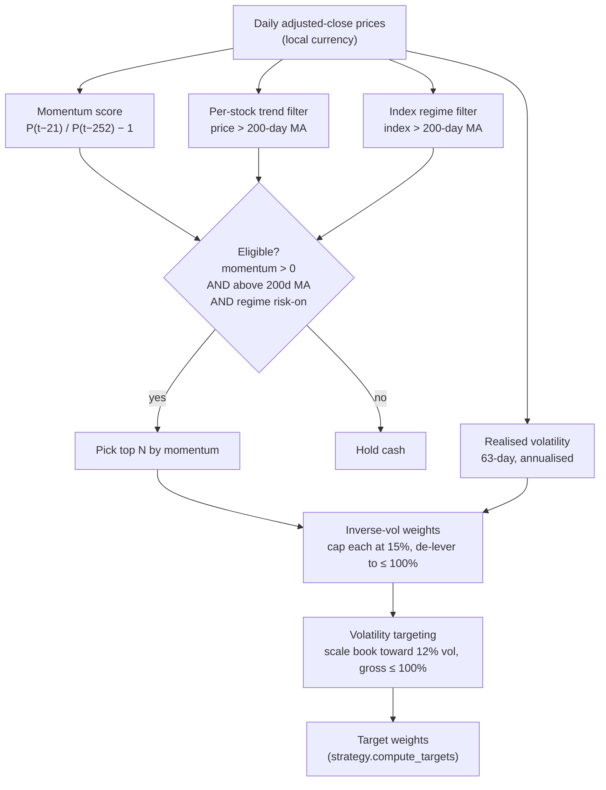
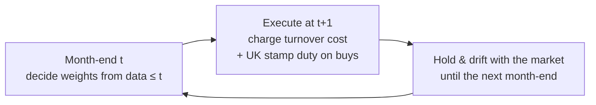
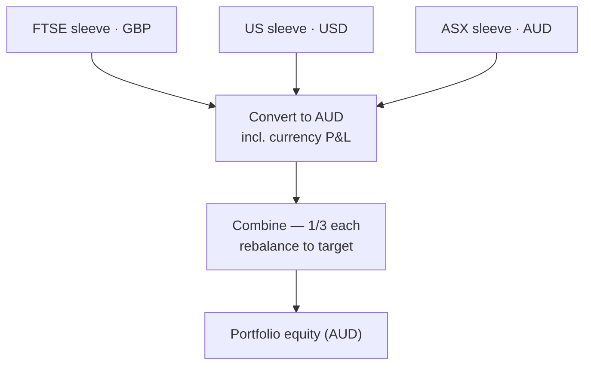

# How the algorithm works

A step-by-step walk-through of the strategy — the maths, the decision flow, and
how a price history turns into orders. For setup and commands see the
[main README](../README.md); for the design history see
[HANDOFF.md](../HANDOFF.md).

---

## 1. The idea in one paragraph

Each month, in each region (FTSE / US / ASX), rank every stock by its
**12-month-minus-1 momentum** (return over the last year, skipping the most
recent month). Buy the strongest names — but only those in an uptrend, and only
while the regional index itself is in an uptrend; otherwise hold cash. Size the
book by **inverse volatility** and scale the whole thing to a **target
volatility**. Rebalance monthly. Run three such books in parallel, each in its
own currency, and report the combined result in AUD. That's it — a classic,
heavily-researched **cross-sectional momentum** strategy with trend and
crash-protection filters.

---

## 2. The per-sleeve pipeline

Everything below runs independently for each region, on that region's prices in
its **local currency**.



### 2.1 Momentum score — *“what's been winning?”*

For each stock, the 12-1 momentum at date *t* is the total return over the last
~12 months, **excluding the most recent ~1 month**:

```
score(t) = price(t − 21) / price(t − 252) − 1
```

- `252` trading days ≈ 12 months, `21` ≈ 1 month (`lookback_days`, `skip_days`).
- Skipping the last month avoids **short-term reversal** (last month's winners
  tend to bounce back down briefly). 12-1 momentum is the single most replicated
  anomaly in equities (Jegadeesh & Titman, 1993).

➡ `signals.momentum_score` · uses only past prices (`shift`), so no lookahead.

### 2.2 Trend filter — *“is this name actually rising?”*

A stock is only eligible if its price is **above its 200-day moving average**.
Momentum can be “strong” simply because a stock is falling more slowly than
others; the trend filter keeps you out of those.

➡ `signals.stock_trend_ok`

### 2.3 Regime filter — *“is the whole market safe?”*

The regional index (ASX 200 / S&P 500 / FTSE 100) must be **above its own
200-day MA**. If it isn't, the sleeve goes **100% cash**. This is the
crash-protection: momentum portfolios blow up in the sharp rebounds *after* bear
markets, and being in cash during the bear avoids that.

➡ `signals.index_risk_on` → `RISK_ON` / `RISK_OFF`

> **Live example (11 Jun 2026):** the ASX 200 was below its 200-day MA, so the
> ASX sleeve was `RISK_OFF` and held 100% cash, while the US and FTSE sleeves
> were risk-on and fully invested. The regime filter doing its job.

### 2.4 Selection — *“pick the book”*

Among the eligible names (momentum > 0 **and** above their 200d MA, **and** the
regime is risk-on), take the **top N by momentum** (`top_n`, default 10).

➡ `signals.select_portfolio`

### 2.5 Weighting — inverse volatility, capped

Within the picks, weight by the **inverse of each stock's volatility** so calm
names get more capital and wild names less (instead of letting the hottest stock
dominate):

```
wᵢ ∝ 1 / volᵢ          then normalise to sum 1
wᵢ = min(wᵢ, 15%)      single-name cap (max_weight)
if Σwᵢ > 1: renormalise (never lever up from capping)
```

Volatility is the trailing 63-day realised vol, annualised (`signals.realised_vol`).

### 2.6 Volatility targeting — steady risk, not steady money

The raw book is scaled so its **estimated portfolio volatility** hits a 12%
annual target (`target_vol`). Portfolio vol is estimated with a
constant-average-correlation approximation (ρ = 0.6):

```
let  wvᵢ = wᵢ · volᵢ
var ≈ (1 − ρ) · Σ wvᵢ²  +  ρ · (Σ wvᵢ)²
vol = √var

scale = min( target_vol / vol , 1.5 )      # cap leverage of the raw book
weights = weights · scale
if gross > 100%: de-lever so gross = 100%   # no leverage (max_gross)
```

In calm markets this scales the book up (toward 100% invested); in turbulent
markets it scales down (more cash), keeping *risk* roughly constant rather than
*capital deployed*.

➡ `strategy.vol_target`

### 2.7 One function to rule them all

Selection **and** vol targeting live in a single function,
**`strategy.compute_targets(prices, index, params)`**, which returns the target
weight vector (summing to ≤ 100%; an empty result means “go to cash”).

This matters: **both the backtester and the live paper trader call this exact
function.** There is no second copy of the weight logic to drift out of sync —
an invariant enforced by `tests/test_consistency.py`.

---

## 3. From target weights to actual trades

Target weights are abstract (“hold 12% of AAPL”). Turning them into trades is
where the no-lookahead rule and the cost model live.



### 3.1 No lookahead

Weights are decided on the **last trading day of the month** using only data up
to that day, then applied on the **next** trading day. Signals at *t*, execution
at *t+1* — always. (`backtest.run_backtest`; verified in `tests/test_strategy.py`
and `tests/test_signals.py`.)

### 3.2 Costs are always on

Every rebalance pays, as a fraction of the book:

```
cost = turnover · (commission_bps + slippage_bps) / 10000
     + buy_turnover · stamp_duty_bps / 10000
```

- `turnover` = Σ |Δweight| (both sides); `buy_turnover` = Σ of the **buys** only.
- **UK stamp duty (0.5%) applies to FTSE purchases only** — a real, asymmetric
  cost that materially affects a high-turnover UK book, modelled explicitly.
- Per-region schedules (`regions.py`):

  | Region | Commission | Min | Slippage | Stamp duty |
  |--------|-----------|-----|----------|------------|
  | ASX  | 8 bps | A$5 | 10 bps | – |
  | US   | 2 bps | US$1 | 5 bps | – |
  | FTSE | 5 bps | £1  | 8 bps | **50 bps (buys)** |

➡ `fees.py`, `backtest.py`

### 3.3 Paper trading reality

The live paper engine (`paper_trade.py`) additionally enforces what a real
account must:

- **Whole shares only** — `shares = floor(equity · weight / price)`.
- The **commission floor** is respected (e.g. tiny ASX trades still cost A$5).
- **Dust trades are skipped** (don't pay a fee to nudge a position by £20).
- A **micro-account mode**: below ~5,000 units of local currency a sleeve can't
  hold the full book in whole shares, so it concentrates into a few names (this
  is how the “fee drag on a tiny account” lesson is demonstrated).

> **Live example:** opening the `full` account (A$100k, 1/3 each) produced 18
> trades — 0 in ASX (risk-off → cash), 8 in US, 10 in FTSE — and equity dipped
> to A$99,831 on day one, purely from spreads, commissions and FTSE stamp duty.

---

## 4. Three sleeves → one AUD portfolio



Each sleeve trades and compounds in its **local currency**. To report in the
base currency (AUD), a sleeve's return is converted *including the currency
move*:

```
r_AUD = (1 + r_local) · (fx(t) / fx(t−1)) − 1      # fx = AUD per 1 local unit
```

So an AUD investor earns the strategy return **and** the FX return. Capital is
split equally (1/3 FTSE, 1/3 US, 1/3 ASX) and trued back to target on a cadence,
paying a small FX spread on the cash that crosses currencies.

- LSE shares are quoted in pence; the FTSE sleeve scales them to pounds
  (`price_scale = 0.01`) so it's internally consistent in GBP.
- ➡ `fx.py`, `portfolio_backtest.py` (backtest) and `paper_trade.py` (live).

> The backtest *rebalances* allocations each period; the paper sim *funds each
> sleeve once* and lets them drift (the realistic “fund the sub-accounts and let
> them run” model). Both are intentional and documented.

---

## 5. Where each piece lives

| Concern | Module |
|--------|--------|
| Strategy knobs (lookback, top_n, target_vol …) | `config.py` (`StrategyParams`) |
| Per-region universe, index, currency, fees, calendar, routing | `regions.py`, `universes.py` |
| Momentum / trend / regime / vol signals | `signals.py` |
| **Target weights (single source of truth)** | `strategy.py` → `compute_targets` |
| Costs (commission floor + UK stamp duty) | `fees.py` |
| No-lookahead walk-forward backtest | `backtest.py` |
| Combine sleeves in AUD + FX | `portfolio_backtest.py`, `fx.py` |
| Live paper trading (persistent state) | `paper_trade.py` |
| Background scheduler | `engine.py` |
| Survivorship-bias fix (point-in-time members) | `constituents.py` |
| Parameter robustness sweep | `sweep.py` |
| Live dashboard | `dashboard/` |

---

## 6. See it for yourself (offline, no network)

Every step is reproducible on synthetic data — meaningless for *performance*,
perfect for *understanding the mechanics*:

```bash
pip install -r requirements.txt

# the full pipeline, end to end, in AUD
python -m trading_algo.run_backtest --synthetic

# one sleeve, with its latest target book printed
python -m trading_algo.run_backtest --region US --synthetic

# is the edge a plateau or a curve-fit peak?
python -m trading_algo.sweep --region US --synthetic

# watch a paper account rebalance, with fees and stamp duty itemised
python -m trading_algo.paper_trade --account demo --capital 100000 --init --synthetic
python -m trading_algo.paper_trade --account demo --synthetic

pytest -q     # 67 tests covering every invariant above
```

---

## 7. What this is *not* (limitations)

- A backtest is a **hypothesis, not a promise**. Default universes are *today's*
  members → survivorship bias (use `--point-in-time` with a constituents file to
  correct it).
- Synthetic results say nothing about returns — they only prove the plumbing.
- Live IBKR execution stays **manual** (`dry_run=False`); the automation does
  **paper** trading only.
- Full limitations and “where to take it next” are in the
  [main README](../README.md#known-limitations-read-these).
