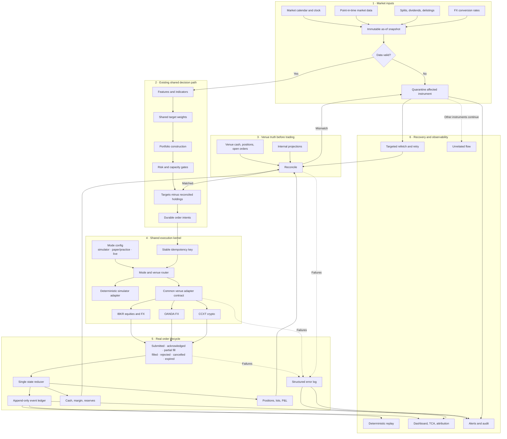

# Paper/live parity execution architecture

**Date:** 2026-07-25  
**Status:** Approved
**Canonical acceptance criteria:** `docs/specs/paper-live-parity.md`

## Objective

Make equity, FX, and crypto behave the same after target weights are produced,
whether the configured venue is a deterministic simulator, broker paper/practice,
or broker live. The design guarantees deterministic state, idempotent submission,
instrument-scoped quarantine, and crash recovery. It does not claim external
venues are always available.

## Chosen approach

Add a shared event-driven execution kernel and keep the existing vectorized
research backtests.

This is more efficient than either alternative:

1. Thin wrappers around today's separate paths have low initial cost but retain
   behavioral drift and duplicate accounting.
2. Replacing every vectorized backtest with a broker simulator gives maximal
   purity but makes research and parameter sweeps unnecessarily slow.
3. A shared execution kernel concentrates realism where it matters—parity
   replay, paper, and live—without taxing the research loop.

## End-to-end architecture

## Core boundaries

### Immutable decision snapshot

Every decision receives a snapshot ID, `as_of` timestamp, market calendar,
source timestamps, prices, corporate actions, FX rates, and data-quality status.
An intent references the snapshot rather than copying mutable current data.

### Order intent

`OrderIntent` is venue-neutral and contains:

- account, strategy, instrument, side, normalized quantity, order type;
- decision price and currency;
- snapshot ID and target/reconciled-position provenance;
- risk checks and their results;
- deterministic idempotency key.

The intent is persisted before any venue call. A retry reads the existing intent
and venue mapping; it never manufactures a new client order ID.

### Venue adapter

IBKR, OANDA, and CCXT implement one contract:

- fetch balances, positions, open orders, and recent fills;
- validate and normalize instrument/order constraints;
- submit or recover an order by idempotency key;
- cancel an order;
- normalize venue responses into shared execution events.

Paper/live is adapter configuration—endpoint, credentials, and account—not a
separate strategy, risk, accounting, or reconciliation branch.

### Order state reducer

One pure reducer accepts the current order state plus a normalized event and
returns the next state. It owns valid transitions and projections for:

- submitted, acknowledged, partially filled, filled;
- rejected, cancelled, expired;
- fees, tax, funding, carry, and slippage;
- cash reservations and release;
- positions, lots, realized P&L, and TCA.

### Event ledger and projections

An append-only SQLite/WAL ledger stores intents and normalized venue events.
Current orders, cash, positions, lots, P&L, and quarantines are rebuildable
projections. Existing book-state rows may remain as read-optimized snapshots,
but they are not authoritative for execution history.

Every event carries:

- event ID, event type, source, source timestamp, and persisted timestamp;
- account, venue, instrument, snapshot, intent, venue-order, and correlation IDs;
- normalized payload plus schema version;
- causation ID linking retries, reconciliations, and operator resolutions to the
  event that triggered them.

Execution events are permanent accounting and audit records. They are never
deleted by operational log-retention policy.

### Operational error log

A separate structured log records failures without becoming accounting truth.
Each record contains:

- timestamp, severity, component, operation, and stable error category;
- account, venue, instrument, intent, venue-order, and correlation IDs when known;
- retryable/non-retryable classification and retry attempt;
- sanitized message and diagnostic context;
- resulting action: retry scheduled, instrument quarantined, or operator action
  required.

Adapter exceptions, reconciliation mismatches, persistence failures, invalid
state transitions, retry exhaustion, and operator resolutions are logged through
one interface. Secret values, tokens, credentials, and raw authentication headers
are redacted before persistence or export. Repeated transient errors may be
aggregated for display, but the first occurrence, latest occurrence, count, and
correlation chain remain queryable.

The dashboard exposes filters by time, severity, account, venue, instrument, and
correlation ID. Event and error exports use the same redaction rules.

## Reconciliation and failure behavior

Reconciliation runs on startup, before a new intent for an instrument, after
terminal order events, and after reconnect.

Differences are classified:

- **Expected latency:** a known pending order explains the difference; refetch.
- **Recoverable:** a venue fill exists but the local event is missing; append it.
- **Unexplained:** quarantine that instrument and alert.

Quarantine blocks new intents only for affected instruments. It clears when a
subsequent reconciliation matches or an operator records an explicit resolution
with evidence. The system never creates an automatic correction trade from an
unexplained difference.

If submission times out after the venue may have accepted the order, the kernel
queries by deterministic client order ID before retrying. It never blindly
resubmits.

## Efficiency

- Keep vectorized research backtests and sweeps unchanged.
- Run the event kernel for golden parity scenarios, paper/practice, and live.
- Batch market, balance, position, and open-order reads per venue when supported.
- Maintain incremental projections rather than replaying the ledger every tick.
- Write events and their resulting projections in one database transaction;
  write error records asynchronously only when doing so cannot hide a failed
  accounting transaction.
- Reconcile only startup/account state plus instruments touched by new or pending
  orders; schedule a lower-frequency full-account audit.
- Reuse venue sessions and capability/instrument metadata within a process.
- Process independent instruments concurrently within venue rate limits while
  serializing state transitions per account and instrument.
- Persist before external side effects, then use asynchronous event consumption
  where the venue supports it and bounded polling otherwise.

## Parity strategy

Parity has three layers:

1. **Pure contract parity:** the same snapshot and holdings create identical
   normalized intents in all modes.
2. **Lifecycle parity:** deterministic scenarios inject partial fills, rejects,
   cancellations, delayed acknowledgements, disconnects, and crash/restart.
3. **Venue conformance:** IBKR paper, OANDA practice, and exchange sandbox/test
   endpoints run the same adapter suite when credentials are available.

The live adapter is enabled only after its paper/practice conformance run passes
for the deployed version and the existing promotion gate approves the account.

## Delivery sequence

1. Domain types, ledger, pure reducer, and deterministic simulator.
2. Structured error logging, correlation, redaction, and query surfaces.
3. Shared planner and reconciliation engine.
4. IBKR adapter for equities and FX.
5. OANDA FX adapter.
6. CCXT crypto adapter.
7. Paper/practice shadow runs with intent and fill comparisons.
8. Instrument-level live canaries behind existing promotion gates.
9. Broader live enablement only after replay, reconciliation, and sandbox
   evidence remain clean.

All adapters are part of the same parity delivery, but this sequence keeps each
venue independently testable and prevents a partially complete adapter from
blocking validation of the kernel.

## Safety properties

- One durable intent maps to at most one venue order.
- Fills, not requested quantities, drive accounting.
- Unknown state pauses the affected instrument.
- Unrelated instruments continue.
- Strategy targets are never recomputed in the execution layer.
- Paper/live differences are limited to endpoint, credentials, and account.
- Live is disabled by default and remains explicitly promoted.
- Every failure is correlated and diagnosable without exposing secrets.
