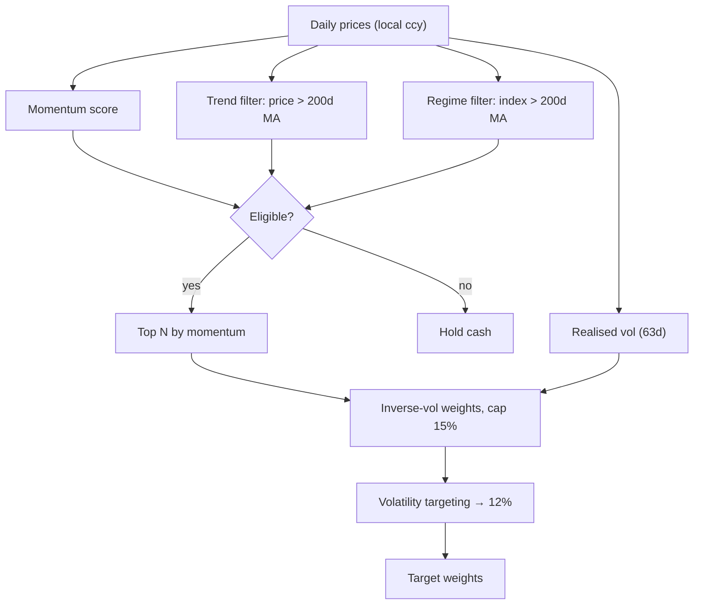

# ⚙️ How the algorithm works

> [!abstract] One paragraph
> Each month, in each region, rank stocks by [[12-1 Momentum]]. Buy the strongest
> in an uptrend while the index is in an uptrend ([[Regime & Trend Filters]]);
> else hold cash. Size by inverse vol and scale to a target vol
> ([[Volatility Targeting]]). Rebalance monthly, [[No-Lookahead|signal at t /
> trade at t+1]]. Run three sleeves, report in AUD.

## 1 · The per-sleeve pipeline

**Signal** — [[12-1 Momentum]]:
$$\text{score}(t) = \frac{P_{t-21}}{P_{t-252}} - 1$$

**Filters** — [[Regime & Trend Filters]]: a stock must be above its 200d MA, and
the index above its own 200d MA, else the sleeve goes 100% cash.

**Weighting**: top N by momentum, inverse-vol, capped at 15%:
$$w_i \propto \tfrac{1}{\text{vol}_i}, \quad w_i \le 15\%, \quad \sum w_i \le 1$$

**Sizing** — [[Volatility Targeting]] to 12%/yr (constant-avg-correlation, ρ=0.6):
$$\text{scale} = \min\!\left(\tfrac{0.12}{\sqrt{\text{var}}},\ 1.5\right),\quad \text{gross} \le 100\%$$

> [!note] One function, two engines
> Selection + vol targeting live in `strategy.compute_targets`. The backtester
> and the live paper trader both call it — no second copy to drift.

## 2 · From weights to trades — [[No-Lookahead]]
Decide on the last trading day of the month from data ≤ t; execute t+1. Each
rebalance pays cost:
$$\text{cost} = \text{turnover}\cdot\tfrac{\text{comm}+\text{slip}}{10^4} + \text{buys}\cdot\tfrac{\text{stamp}}{10^4}$$

> [!warning] UK stamp duty
> 0.5% on **FTSE purchases only** — asymmetric, modelled explicitly. See [[Reference]].

## 3 · Three sleeves → one AUD book
$$r_\text{AUD} = (1 + r_\text{local})\cdot\frac{fx_t}{fx_{t-1}} - 1$$
Each sleeve trades local; AUD reporting includes the currency move. Capital is
split ⅓ / ⅓ / ⅓ and trued to target on a cadence.

> [!example] First live run (2026-06-11)
> 18 trades — 0 ASX (risk-off → cash), 8 US, 10 FTSE — equity A$99,831 after costs.

> [!danger] Limitations
> A backtest is a hypothesis, not a promise; default universes are survivorship
> -biased; live broker execution stays manual (the automation does paper only).

Related: [[Multi-Region Momentum]] · [[Reference]]
