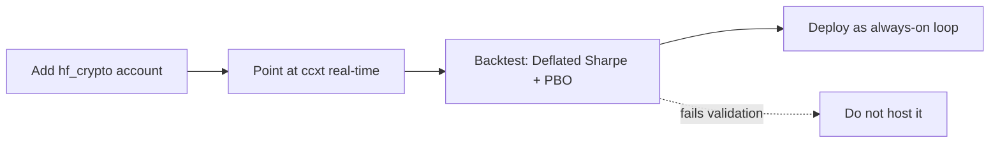

# 🕓 24/7 Trading — what can actually run continuously

Research capture from a 2026-07-25 session. **Nothing here is built yet.**

> [!abstract] The finding in one sentence
> Only the crypto book can genuinely trade 24/7; the equity sleeves are a
> *monthly* strategy and running them continuously does nothing at all.

## What each book can actually do

| Book | Real cadence | Continuous? |
|---|---|---|
| Equity sleeves (full / small / ultra / experimental) | **rebalances once a month** | **No** — and not a hosting limitation. Only trades on the first run of a new month; LSE/NYSE/ASX are shut most of the day anyway. |
| FX books (matt / partner) | daily bars | 24×**5** — the FX week genuinely closes Fri 22:00 → Sun 22:00 UTC (`forex/engine.py` `fx_market_open`) |
| daytrader | 60m bars, hourly | 24×5, currently on Yahoo data that is **~15 min delayed** |
| **crypto** | 1m bars | **Yes, truly 24/7** — crypto never closes, `ccxt` data is free and real-time |

So "24/7" concretely means: **an always-on crypto book, plus FX at 24×5.** The
monthly momentum sleeves stay a monthly cron job — that is what the strategy
*is*, not a constraint of where it runs.

## The repo already anticipated this

`fx_config.py` carries an `hf_crypto` profile whose comment reads:

> Run via `engine --loop` on a low-latency VPS with `--exchange binance --bar 1m`.

The `--source` / `--exchange` / `--bar` plumbing is already end-to-end through
the engine, paper book and backtest. What is missing is only that **no account
uses it**: `ACCOUNTS` has matt, partner, daytrader and multiasset. A crypto-only
universe is ready at `pairs.py` (`UNIVERSES["crypto"]`).

## The real blocker is the data feed, not the hosting

Yahoo is ~15 minutes delayed and rate-limits datacenter IPs hard, so deploying
without changing the feed buys nothing. See `docs/DATA_FEEDS.md`:

| Asset | Free real-time route | Credentials |
|---|---|---|
| Crypto | `--source crypto --exchange binance` (`ccxt`, MIT) | **none** |
| FX | OANDA free *practice* account | `OANDA_API_TOKEN` |
| US equities | Alpaca free tier (**IEX only**, partial tape) | `APCA_API_KEY_ID` / `APCA_API_SECRET_KEY` |

> [!warning] Binance geo-blocking
> Binance blocks some regions and cloud IPs. Host region matters; `ccxt`
> supports OKX / Bybit / Kraken as fallbacks.

## Cron vs daemon — this reverses the deployment default

At 1-minute cadence a scheduled container is **wrong**: you pay a cold start
(pandas/numpy import plus a data fetch) every single minute. Use the always-on
`engine --loop`, which `forex/engine.py` was built for — its `AgentPool` is one
long-lived thread pool reused across cycles specifically to keep per-cycle
latency flat. Reserve cron for the monthly equity sleeves.

> [!danger] This is a strategy change wearing a deployment costume
> Going from monthly to minute-scale is not a hosting decision. `docs/CRYPTO_HF.md`
> puts it well — *"honest fast, not alpha faucet"* — and warns that costs bite
> hard at 1-minute turnover. A book that is profitable monthly can be reliably
> unprofitable at ~1,440 decisions a day on spread alone. Validate with
> `forex/research.py` (Deflated Sharpe + PBO) **before** funding it.
> That is a "backtest it first", not a "do not". Paper costs nothing to run.

## Suggested order

Deploy last — the backtest is what tells you whether the 24/7 version is worth
hosting at all.

Related: [[Railway Deployment]] · [[Multi-Region Momentum]]

#trading/infrastructure
