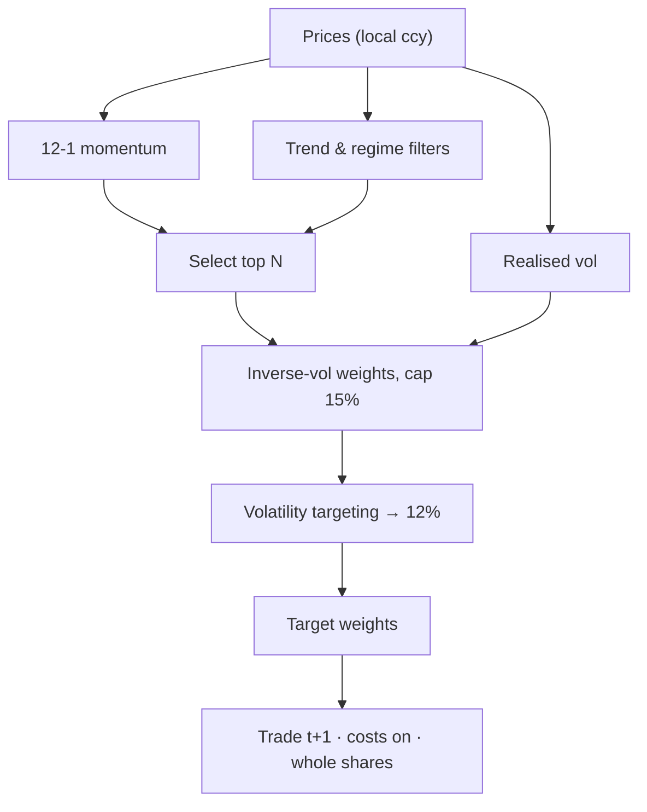

# 🌐 Multi-Region Momentum — Map of Content

A monthly-rebalanced **12-1 cross-sectional momentum** system run as three
independent regional sleeves — **FTSE**, **US** and **ASX** — combined into one
book and reported in **AUD**.

> [!abstract] In one sentence
> Each month, in each region, buy the strongest stocks in an uptrend while the
> market itself is in an uptrend; otherwise hold cash. Size by inverse vol, scale
> to a target vol, run three books across three currencies.

## Start here
- [[How It Works]] — the full step-by-step walk-through

## Concepts
- [[12-1 Momentum]] · [[Regime & Trend Filters]] · [[Volatility Targeting]] · [[No-Lookahead]]

## Reference
- [[Reference]] — region settings, costs, commands (generated from code)

> [!tip] Syncing this vault
> This folder is an Obsidian vault committed inside the `Trading-Algo` repo. To
> keep it current: `git pull` in the repo (notes update on disk), or install the
> **Obsidian Git** community plugin for in-app pull/push. Regenerate the
> code-derived notes with `make obsidian`.

#trading/momentum
